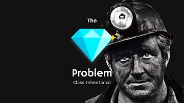

# Diamond Problem ve Deadly Diamond of Death

Nesne yönelimli programlama (OOP) paradigmasında, "Diamond Problem" veya "Deadly Diamond of Death" olarak bilinen durum, çoklu kalıtım kullanıldığında ortaya çıkan bir mimari problemdir. Bu sorun, bir sınıfın aynı metot veya özellikleri iki farklı türetilmiş sınıf yoluyla miras alması durumunda hangi metot veya özelliğin çağrılacağı konusunda belirsizlik oluşmasıyla ilgilidir.

## Diamond Problem Nedir?
"Diamond Problem", adını kalıtım yapısının elmas (diamond) şekline benzemesinden alır. Aşağıdaki örnek, bu durumu açıklar:





### Örnek: Hayvanlar Alemi

1. `HayvanlarAlemi` sınıfı, temel bir sınıf olarak düşünülür ve tüm hayvanlar için ortak bir `YemekYe()` metodu barındırır.
2. `Kedi` ve `Köpek` sınıfları, `HayvanlarAlemi` sınıfından türetilir ve `YemekYe()` metodunu kendi özel davranışlarına göre geçersiz kılar (override eder).
3. `EvHayvanlari` sınıfı, hem `Kedi` hem de `Köpek` sınıflarından türetilir.

```plaintext
HayvanlarAlemi
   /       \
 Kedi     Köpek
   \       /
  EvHayvanlari
```

### Problem:
`EvHayvanlari` sınıfı bir nesne oluşturduğunda `YemekYe()` metodu çağrıldığında, bu metodun `Kedi` sınıfındaki mi yoksa `Köpek` sınıfındaki mi uygulamanın çalıştırılacağı belirsizdir. Bu, kodda istenmeyen davranışlara ve karmaşıklıklara yol açar.

### Java'daki Çözüm
Java, bu problemi çözmek için çoklu sınıf mirasını (multiple inheritance) yasaklamıştır. Bir sınıf yalnızca bir sınıftan türetilebilir (`extends` anahtar kelimesi), ancak bir sınıf birden fazla arabirimi (`interface`) uygulayabilir (`implements` anahtar kelimesi).

#### Java 8 ve Sonrası: Varsayılan Metotlar
Java 8 ile birlikte, arabirimlere varsayılan metotlar eklenmiştir. Bu durum, çoklu arabirimlerin uygulanması sırasında benzer sorunların ortaya çıkmasına yol açabilir. Ancak Java, bu durumu açık bir şekilde çözmenizi gerektirir:

```java
interface Kedi {
    default void yemekYe() {
        System.out.println("Kedi gibi yemek yiyor.");
    }
}

interface Kopek {
    default void yemekYe() {
        System.out.println("Köpek gibi yemek yiyor.");
    }
}

class EvHayvanlari implements Kedi, Kopek {
    @Override
    public void yemekYe() {
        Kedi.super.yemekYe(); // Belirli bir arabirimin metodu çağrılır.
        System.out.println("Ev hayvanı farklı bir şekilde yemek yiyor.");
    }
}

public class Main {
    public static void main(String[] args) {
        EvHayvanlari evHayvani = new EvHayvanlari();
        evHayvani.yemekYe();
    }
}
```

### Çıktı:
```
Kedi gibi yemek yiyor.
Ev hayvanı farklı bir şekilde yemek yiyor.
```
Bu, Java'nın çoklu arabirim desteği sırasında olası belirsizlikleri açıkça çözmenizi sağladığı bir yöntemdir.

## C#'ta Diamond Problem
C# dilinde çoklu sınıf mirası desteklenmediğinden dolayı Diamond Problem ortaya çıkmaz. Ancak, C# bir sınıfın birden fazla arabirimi uygulamasına izin verir. Arabirimlerde aynı metodun tanımlanması durumunda, C# da benzer bir açık çözüm gerektirir:

```csharp
using System;

interface IKedi
{
    void YemekYe();
}

interface IKopek
{
    void YemekYe();
}

class EvHayvanlari : IKedi, IKopek
{
    void IKedi.YemekYe()
    {
        Console.WriteLine("Kedi gibi yemek yiyor.");
    }

    void IKopek.YemekYe()
    {
        Console.WriteLine("Köpek gibi yemek yiyor.");
    }

    public void YemekYe()
    {
        ((IKedi)this).YemekYe();
        ((IKopek)this).YemekYe();
        Console.WriteLine("Ev hayvanı yemek yiyor.");
    }
}

class Program
{
    static void Main()
    {
        EvHayvanlari evHayvani = new EvHayvanlari();
        evHayvani.YemekYe();
    }
}
```

### Çıktı:
```
Kedi gibi yemek yiyor.
Köpek gibi yemek yiyor.
Ev hayvanı yemek yiyor.
```

C# dilindeki bu çözüm, metodun hangi arabirime ait olduğunu açıkça belirtmenizi sağlar.

## Özet
Diamond Problem, çoklu kalıtım kullanılan programlama dillerinde ortaya çıkan bir tasarım problemidir. Bu sorun, özellikle aynı metotların farklı yollarla geçersiz kılınması durumunda hangi metodun çağrılacağına karar vermeyi zorlaştırır. Java ve C# gibi modern diller, bu problemi farklı yollarla ele alır:

- **Java**: Çoklu sınıf mirasını yasaklar ve arabirimlerle çözüm sunar.
- **C#**: Çoklu sınıf mirasını desteklemez ve açık bir şekilde metodun hangi arabirime ait olduğunu belirtmenizi gerektirir.

Bu yaklaşımlar, OOP prensiplerini takip ederken yazılım mimarisinde karmaşıklığı önlemek için geliştirilmiştir.
